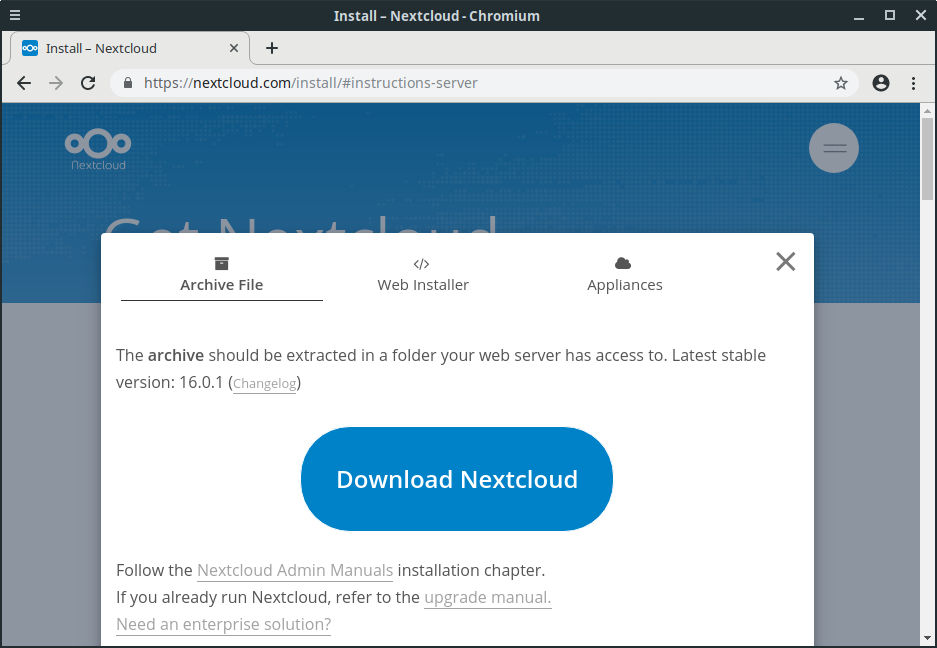
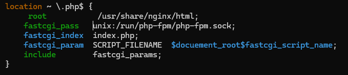
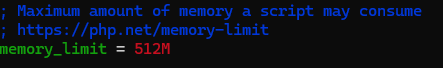
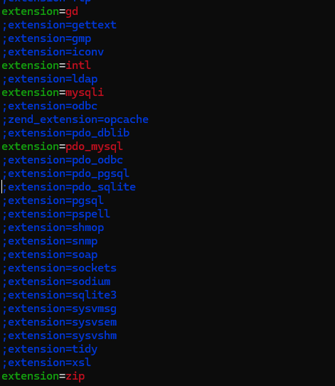
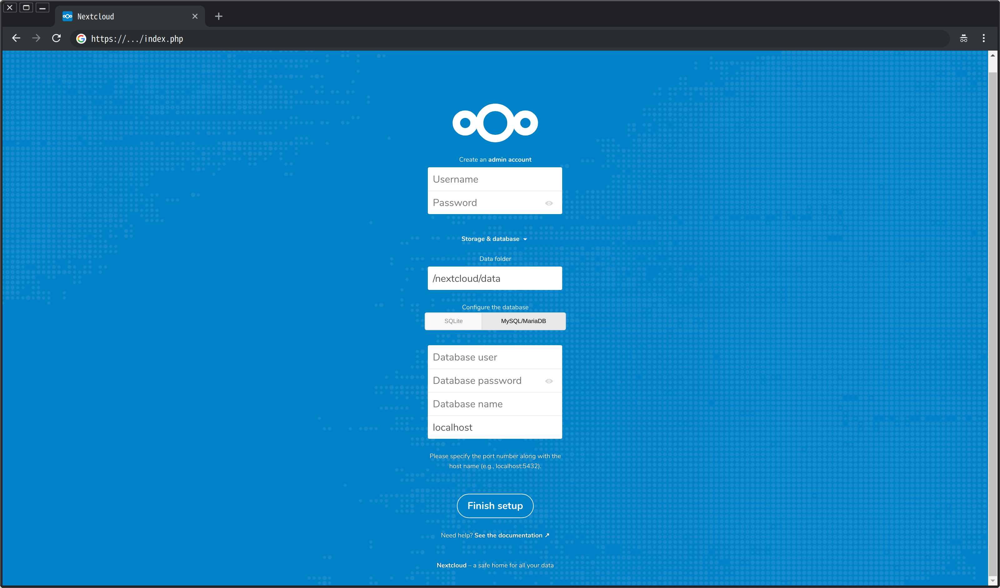

# Assignment 1: NextCloud Server Setup Project Documentation

## Authors: Tanish, Luis and Sobhan

## Submitted to: Nathan

## Course: 2420

### Introduction

#### What is Nextcloud?

Nextcloud is an open-source, self-hosted file synchronization and sharing platform that allows users to store and access their files, calendars, contacts, and more, all in one place. It provides functionalities similar to popular cloud storage services like Google Drive or Dropbox but offers greater control, privacy, and customization options.

#### Why Self-Host Nextcloud?

Self-hosting Nextcloud offers several advantages:

1. **Data Control:** Users have full control over their data, ensuring privacy and security.
2. **Customization:** Self-hosted instances can be tailored to specific needs with custom extensions, themes, and integrations.
3. **Cost-Effective:** Self-hosting can be more cost-effective in the long run compared to subscription-based cloud storage services.
4. **Scalability:** Self-hosted servers can be easily scaled up or down based on demand.
5. **Learning Experience:** Setting up and managing a Nextcloud server provides valuable experience and knowledge in server administration and web technologies.

---

## System Requirements

When setting up a Nextcloud server, we have to work with the  following :

- Arch Linux server with root access
- A domain name or a static IP address
- A web server (e.g., Apache or Nginx)
- PHP and its required extensions
- A database server (e.g., MySQL or MariaDB)
- Optional: SSL certificate for secure connections

---

## Week 1: Initial Setup and Planning

### Steps

**Step 1:** Install and update the Arch server:

```bash
sudo pacman -Syu
```

**Step 2:** Change the hostname

```bash
sudo vim /etc/hostname
```

- Edit the hostname in the file to change the hostname for the server

**Step 3:** Reboot the server for effects to take place

**Step 4:** Next we want to find the the download URL for Nextcloud



**Note:** You could also use <https://download.nextcloud.com/server/releases/latest.zip>
This link will always get the latest zip file for the nextcloud server.

**Step 5:** We are going to install `wget` on our server as it will allow us to get the zip file from the URL.

```bash
sudo pacman -S wget
```

**Step 6:** Now, Download the nextcloud Zip file using the following command

```bash
wget https://download.nextcloud.com/server/releases/latest.zip
```

**Note:** We have just downloaded the zip file, we will deal with it later after we set up some other requirements.

### Addtional Research

---

### Exploring `wget`: A Comprehensive Guide to Command-line Downloading

#### 1. Introduction to `wget`

- **Definition and Purpose**:
  - `wget` is a command-line utility used for non-interactive downloading of files from the web. It is widely used in scripting and automation tasks.

#### 2. Basic Usage

- **Downloading Files**:
  - The basic syntax for downloading a file is `wget [URL]`. Example: `wget https://example.com/file.zip`.
- **Download Resuming**:
  - `wget` supports resuming interrupted downloads using the `-c` or `--continue` option. Example: `wget -c https://example.com/largefile.zip`.

#### 3. Security Considerations

- **SSL/TLS Support**:
  - `wget` supports HTTPS connections and verifies server certificates by default, ensuring secure data transfer.

#### 4. Platform Compatibility

- **Cross-Platform Support**:
  - `wget` is available on various operating systems, including Linux, macOS, and Windows, making it a versatile tool for command-line downloading.
  
---

### Week 1 Summary

#### Activities

- Conducted research on Nextcloud and its requirements.
- Installed Arch Linux on a test server for experimentation.
- Download the nextcloud zip package
- Discussed the division of tasks among team members.
- Outlined the project timeline and milestones.
- Set up a shared document for collaborative note-taking.

#### Challenges Faced

- Understanding Arch Linux installation and configuration.
- Finding a service to download the package.
- Deciding on the optimal web server (Apache vs. Nginx) for our deployment.
- Clarifying the scope of customization required for Nextcloud.

#### Solutions Implemented

- Consulted Arch Linux documentation and online resources for installation guidance.
- Found `wget` and used it on the server to get the nextcloud package.
- Conducted comparative analysis of Apache and Nginx to determine the best fit for our needs.
- Scheduled regular team meetings to address any uncertainties and make informed decisions.

---

## Week 2: Configuring Database for Nextcloud Server

### Steps

**Step 1:** Install the MariaDB package from the nearest mirror.

```bash
sudo pacman -S mariadb
```

Before starting the MariaDB service, initialize the database with the below command. You may also change the data directory of your choice, provided you set `datadir=YOUR_DATADIR` under the section [mysqld] of `/etc/my.cnf.d/server.cnf.`

**Step 2:** Run the following command

```bash
sudo mariadb-install-db --user=mysql --basedir=/usr --datadir=/var/lib/mysql
```

**Step 3:** Start and enable the MariaDB service with the following command.

```bash
sudo systemctl enable --now mariadb
```

**Step 4:** Once the service is up, verify the status of the MariaDB service.

```bash
sudo systemctl status mariadb
```

**Step 5:** Next we are going to add a liitle more security to our database by using `mysql_secure_installation`

```bash
sudo mysql_secure_installation
```

Now  you will be asked a series of questions to answer to customize the installation. To get a better undersanding of the questions [refer to this section](#questions)

**Step 6:** Next we are going to setup our database. to acieve this, we need to enter the `Mariadb` enviornment.

```bash
sudo mariadb
```

**Step 7:**  Create database named nextcloud using SQL statement.

```sql
CREATE DATABASE nextcloud;
```

You could verify if the databae was created by using the `SHOW DATABASES;` command.

**Step 8:** jNext we want to grant priveleges to the user.

```sql
GRANT ALL PRIVILEGES ON nextcloud.* TO 'nextcloud@localhost' IDENTIFIED BY 'password';
```

**Note:** Rember to change "password" to your password as we would need it to log in later.

**Step 9:** Now run the command to flush the privileges.

```sql
FLUSH PRIVILEGES
```

### Additional Research

### Research on `mysql_secure_installation` for MariaDB

#### Overview of `mysql_secure_installation`

- **Definition**: `mysql_secure_installation` is a command-line script designed to enhance the security of the MariaDB installation by performing several security-related tasks.
- **Purpose**: The script prompts the user to set a root password, remove anonymous users, disallow root login remotely, and remove test databases, among other security measures.

#### Questions

Here are the answers to the key questions regarding `mysql_secure_installation` for MariaDB:

1. **Setting the Root Password: Why is it Important?**
   - Setting the root password is crucial for securing access to the MariaDB server. Without a root password, anyone can access and modify databases, posing a significant security risk.

2. **Removing Anonymous Users and Disallowing Root Login Remotely: Why is it Necessary?**
   - Removing anonymous users and disallowing root login remotely are essential security measures. Anonymous users have unrestricted access to the database, while allowing root login remotely increases the risk of unauthorized access and potential security breaches.

3. **Removing Test Databases: What are the Risks?**
   - Test databases often contain sensitive information and vulnerabilities that can be exploited by attackers. Removing test databases reduces the attack surface and minimizes the risk of unauthorized access and data breaches.

4. **Any Precautions Before Running `mysql_secure_installation`?**
   - Before running `mysql_secure_installation`, ensure that you have a backup of your databases in case any unintended changes occur. Additionally, review the existing user accounts and privileges to avoid inadvertently removing necessary accounts.

5. **Customization Options: Can `mysql_secure_installation` be Customized?**
   - `mysql_secure_installation` does not offer extensive customization options. However, users can manually perform the security tasks covered by the script according to their specific requirements.

6. **Logging and Reporting: Does `mysql_secure_installation` Provide Logging or Reporting?**
   - `mysql_secure_installation` does not provide logging or reporting functionalities. Users may need to manually log the actions performed by the script for auditing purposes.

7. **Post-Installation Verification: How to Verify the Security Enhancements?**
   - After running `mysql_secure_installation`, verify that the root password is set, anonymous users are removed, root login is disallowed remotely, and test databases are deleted. Additionally, review the MariaDB log files for any error messages or warnings related to the script's execution.

8. **Best Practices for Regular Maintenance and Security Updates: What Are They?**
    - Regularly update MariaDB to the latest version to patch security vulnerabilities and apply security updates promptly. Perform routine security audits, backup database regularly, and monitor database activity for any suspicious behavior to maintain a secure MariaDB environment over time.

By reading these questions and exploring relevant resources, you'll be able to have a comprehensive understanding of `mysql_secure_installation` and its role in enhancing the security of MariaDB installation.

---

### Week 2 Summary

#### Activities

- **Database Selection**: Conducted research on suitable database management systems (DBMS) for Nextcloud, ultimately selecting MariaDB for its compatibility and performance.
  
- **Installation**: Installed `MariaDB` on the server, following the installation instructions provided by Arch Linux's package manager.

- **Database Configuration**: Created a dedicated database and user for Nextcloud within the MariaDB environment, ensuring proper permissions and security settings.

- **Nextcloud Integration**: Modified the Nextcloud configuration file (`config.php`) to specify MariaDB as the database backend, providing details such as database name, user credentials, and host information.

- **Testing and Validation**: Thoroughly tested the database connection from Nextcloud to MariaDB, ensuring successful integration and functionality.

- **Documentation**: Documented the entire process of MariaDB setup, including installation steps, database configuration details, and any troubleshooting performed.

#### Challenges Faced

- **Configuration Complexity**: Dealing with the intricacies of configuring MariaDB for Nextcloud, including setting up users, permissions, and ensuring compatibility with Nextcloud's requirements.

- **Security Considerations**: Ensuring proper security measures were implemented within MariaDB, including strong password policies and restricted user access, to safeguard Nextcloud data.

- **Integration Issues**: Addressing any compatibility issues or errors encountered during the integration of Nextcloud with MariaDB, such as connection errors or database initialization problems.

#### Solutions Implemented

- **Thorough Research**: Conducted in-depth research on MariaDB setup for Nextcloud, leveraging official documentation and community resources to ensure correct configuration and best practices.

- **Security Measures**: Implemented strict security measures within MariaDB, including using strong passwords, restricting user privileges, and enabling encryption to enhance data protection.

- **Testing and Validation**: Adopted a methodical approach to testing the database connection, conducting extensive validation tests to verify the integrity and functionality of the MariaDB integration with Nextcloud.

- **Collaborative Troubleshooting**: Engaged with team members and online communities to troubleshoot any integration issues or errors encountered during the setup process, seeking advice and solutions collaboratively.

---

### Week 3

1. Install and configure the web server:

  ```bash
  sudo pacman -S nginx
  ```

- Installs the web server software (Nginx) on your Linux server.

**Note:** You colud also use the `-mainline` option to install the latest version of nginx which will have the most cutting edge technology but also can result in potential bugs.

**Step 2:** Start and enable the Nginx service:

```bash
  sudo systemctl start nginx
  sudo systemctl enable nginx
```

**Step 3:** Install PHP and other extensions:

```bash
  sudo pacman -S php php-fpm php-gd php-intl
```

- Installs php
- PHP-FPM is a processor for PHP,  that allows our site to handle high a high volume of traffic.
- php-gd allows for the creation, manipulation, and output of image files, like `.jpg` or `.png.`
- PHP-intl is a wrapper for the ICU library. Lets php use ICU services like Time Calcualtions, Unicode Support, and formatting.

4. Start and enable the PHP-FPM service:

```bash
  sudo systemctl start php-fpm
  sudo systemctl enable php-fpm
```

5. Configure Nginx to use PHP processor. Open the default Nginx

```bash
  sudo vim /etc/nginx/nginx.conf
```

- Scroll down to `location ~\.php$` with all the information like root
- Change root /usr/share/nginx/html;
  - Sets the root directory.
- change pass to unix:/run/php-fpm/php-fpm.sock;
  - This makes nginx run as a sort of reverse proxy. This defines where nginx will forward requests to.
- Change /scripts in the Script_Filename to `$document_root$fastcgi_script_name;`

Here is a reference image to match the configurations.



6. Test the configuration to make sure there are no syntax errors:

```bash
    sudo nginx -t
```

If no errors are reported, restart Nginx to apply the changes:

7. Next, we want to enable some extensions from the PHP module.

```bash
    sudo vim /etc/php/php.ini
```

Find the memory_limit line and change it from `memory_limit = 128M` to `memory_limit = 512M`



Next, We want to uncomment the extensions in order to enable them. To uncomment, remove the preceeding semicolon (;) from the line.

```bash
extension=gd 
extension=intl 
extenstion=mysqli
extension=pdo_mysql
extension=zip
```



If any of these are already uncommented, it's fine.

Finally run the following commands for the effects to take place:

```bash
sudo systemctl start php-fpm 
sudo systemctl enable php-fpm
sudo systemctl restart nginx
```

### Activities

- **Nginx and PHP Installation**: Installed Nginx and PHP on the server using the `pacman` package manager.
  
- **Nginx Service Management**: Started and enabled the Nginx service using the `systemctl` command.

- **PHP Extension Installation**: Installed necessary PHP extensions, such as `php-gd`, `php-intl`, `php-zip`, etc., to enhance PHP functionality.

### Challenges Faced

- **Package Version Selection**: Ensuring the correct package versions were selected during Nginx installation to maintain compatibility with other components.

- **Nginx Service Configuration**: Configuring and starting the Nginx service accurately to avoid errors and ensure proper operation.

- **PHP Extension Selection**: Selecting and installing the appropriate PHP extensions for compatibility with existing configurations and desired functionality.

### Solutions Implemented

- **Package Version Verification**: Checked package versions and dependencies before installing Nginx to ensure compatibility with other system components.

- **Nginx Service Configuration Check**: Verified Nginx service configuration files for accuracy and adjusted permissions as needed to ensure smooth service startup.

- **PHP Extension Research**: Researched and installed required PHP extensions, ensuring they met project requirements and were compatible with existing PHP configurations.

---

### Week 4

**Step 1:** Now, we are going to use the nextcloud zip file downloaded in week 1. For this we are going the use `unzip` utility. You can download it with the `sudo pacman -S unzip` command.

```bash
unzip latest.zip
```

**Step 2:** Run the following command to move the nextcloud folder to the webapps directory.

```bash
mv nextcloud /usr/share/webapps/nextcloud
```

**Step 3:** Give permissions of nextcloud to the webserver user

```bash
sudo chown R http:http /usr/share/webapps/nextcloud/
```

**Step 4:** Create a directory where we can edit the nextcloud config file

```bash
sudo mkdir /etc/nginx/conf.d
```

Now crete and open the config file

```bash
sudo vim /etc/nginx/conf.d/nextcloud.conf
```

**Step 5:** Insert the following into the `.conf` file

```nginx
server {
    listen 80;
    server_name localhost;

    # Add headers to serve security related headers
    add_header X-Content-Type-Options nosniff;
    add_header X-XSS-Protection "1; mode=block";
    add_header X-Robots-Tag none;
    add_header X-Download-Options noopen;
    add_header X-Permitted-Cross-Domain-Policies none;

    # Path to the root of your installation
    root /usr/share/webapps/nextcloud/;

    location = /robots.txt {
        allow all;
        log_not_found off;
        access_log off;
    }

    # The following 2 rules are only needed for the user_webfinger app.
    # Uncomment it if you're planning to use this app.
    #rewrite ^/.well-known/host-meta /public.php?service=host-meta last;
    #rewrite ^/.well-known/host-meta.json /public.php?service=host-meta-json
    # last;

    location = /.well-known/carddav {
        return 301 $scheme://$host/remote.php/dav;
    }
    location = /.well-known/caldav {
       return 301 $scheme://$host/remote.php/dav;
    }

    location ~ /.well-known/acme-challenge {
      allow all;
    }

    # set max upload size
    client_max_body_size 512M;
    fastcgi_buffers 64 4K;

    # Disable gzip to avoid the removal of the ETag header
    gzip off;

    # Uncomment if your server is build with the ngx_pagespeed module
    # This module is currently not supported.
    #pagespeed off;

    error_page 403 /core/templates/403.php;
    error_page 404 /core/templates/404.php;

    location / {
       rewrite ^ /index.php$uri;
    }

    location ~ ^/(?:build|tests|config|lib|3rdparty|templates|data)/ {
       deny all;
    }
    location ~ ^/(?:\.|autotest|occ|issue|indie|db_|console) {
       deny all;
     }

    location ~ ^/(?:index|remote|public|cron|core/ajax/update|status|ocs/v[12]|updater/.+|ocs-provider/.+|core/templates/40[34])\.php(?:$|/) {
       include fastcgi_params;
       fastcgi_split_path_info ^(.+\.php)(/.*)$;
       fastcgi_param SCRIPT_FILENAME $document_root$fastcgi_script_name;
       fastcgi_param PATH_INFO $fastcgi_path_info;
       #Avoid sending the security headers twice
       fastcgi_param modHeadersAvailable true;
       fastcgi_param front_controller_active true;
       fastcgi_pass unix:/run/php-fpm/php-fpm.sock;
       fastcgi_intercept_errors on;
       fastcgi_request_buffering off;
    }

    location ~ ^/(?:updater|ocs-provider)(?:$|/) {
       try_files $uri/ =404;
       index index.php;
    }

    # Adding the cache control header for js and css files
    # Make sure it is BELOW the PHP block
    location ~* \.(?:css|js)$ {
        try_files $uri /index.php$uri$is_args$args;
        add_header Cache-Control "public, max-age=7200";
        # Add headers to serve security related headers (It is intended to
        # have those duplicated to the ones above)        
        add_header X-Content-Type-Options nosniff;
        add_header X-XSS-Protection "1; mode=block";
        add_header X-Robots-Tag none;
        add_header X-Download-Options noopen;
        add_header X-Permitted-Cross-Domain-Policies none;
        # Optional: Don't log access to assets
        access_log off;
   }

   location ~* \.(?:svg|gif|png|html|ttf|woff|ico|jpg|jpeg)$ {
        try_files $uri /index.php$uri$is_args$args;
        # Optional: Don't log access to other assets
        access_log off;
   }
}
```

Now save and exit the file. This will configure the nexctloud server block.

**Step 6:** Now lets edit the `nginx.conf` file to include this server block.

```nginx
sudo vim /etc/nginx/nginx.conf

#Go to the http section and add the following

include /etc/nginx/conf.d/*.conf;
```

Configures nginx to look at all `.conf` files in that directory.

**Step 7:** To set configuration options in the php module

```bash
sudo vim /etc/php/php-fpm.d/www.conf
```

Uncomment both the `env[PATH]` line and the `env[TMP]` line.This passes both PATH and TMP environment variables

**Step 8:** Make the `/var/nextcloud` directory and changes the ownership to the http user. This directory is a data directory.

```bash
sudo mkdir /var/nextcloud 
sudo chown http:http /var/nextcloud
```

Now, Run

```bash
sudo chmod 750 /var/nextcloud
```

Gives the owner read,write and execute (rwx) privileges, the group read and execute (rx) privileges, and other users no privileges.

**Step 9:** Make the `/usr/share/webapps/nextcloud/data` directory with the `-p` argument. Make `http` the owner. Change the permissions to 750 of the above

```bash
sudo mkdir -p /usr/share/webapps/nextcloud/data
sudo chown http:http /usr/share/webapps/nextcloud/data
sudo chmod 750 /usr/share/webapps/nextcloud/data
```

**Step 10:** Security for php is a bit strict, so we will change that.

```bash
sudo systemctl edit php-fpm.service
```

Now copy and paste the following into the document

```bash
[Service]
ReadWritePaths = /usr/share/webapps/nextcloud/apps
ReadWritePaths = /usr/share/webapps/nextcloud/data
ReadWritePaths = /etc/webapps/nextcloud/config
ReadWritePaths = /var/nextcloud
```

**Step 11:** Finally run the following commands for the effects to take place:

```bash
sudo systemctl start php-fpm 
sudo systemctl restart nginx
```

**Step 12:** 

- Enter your droplets ip address into a browser

- Create an admin account, this is not the database account from  before. So feel free to add you credentials.
- Replace the data folder to `/var/nextcloud`
- Input the database username and password from before.
- The database name is nextcloud
- Click on Finish Setup
- You are now able to use nextcloud

### Future aspects

Here are some future extensions and enhancements that we plan on doing:

1. **Integration with Collaborative Tools**: Extend Nextcloud's functionality by integrating collaborative tools such as OnlyOffice or Collabora Online for real-time document editing and collaboration.

2. **SSL Certificate**: Use services like Let's Encrypt to get SSl  license and establish secure connections to the server while also adding a domain name.

3. **Enhanced Security Features**: Implement additional security measures such as two-factor authentication (2FA), file encryption, and intrusion detection systems to enhance data protection.

4. **Automated Backups**: Set up automated backup solutions to regularly back up Nextcloud data and configurations, ensuring data integrity and disaster recovery capabilities.

5. **Custom Themes**: Customize the Nextcloud interface with custom themes to enhance user experience.

6. **User Training and Documentation**: Develop comprehensive user training materials and documentation to educate users on Nextcloud installation, features and best practices for effective usage.

7. **Advanced File Management Features**: Implement advanced file management features such as versioning, file tagging, and advanced search capabilities to improve file organization and retrieval.

8. **Community Engagement**: Encourage community engagement by promoting Nextcloud within BCIT, organizing workshops within the set, and gathering feedback for continuous improvement and make them switch to our nextcloud server.

9. **Performance Optimization**: Continuously optimize Nextcloud's performance by fine-tuning server configurations, implementing caching strategies, and monitoring resource usage.

10. **Scalability and High Availability**: Plan for scalability and high availability of the Nextcloud deployment to accommodate future growth and ensure reliable access to resources.

These proposed extensions can enhance the functionality, usability, and security of our Nextcloud deployment for educational purposes, providing valuable learning experiences and practical applications for our users.

## Video Link: <https://youtu.be/cZ5A-U6P2nw>

## Conclusion

Setting up a Nextcloud server involves installing and configuring a web server, PHP, a database server, and Nextcloud itself. By following the steps outlined in this research note, you can create your own self-hosted file sync and share solution.

## References

- Nextcloud documentation: <https://docs.nextcloud.com/>
- Apache documentation: <https://httpd.apache.org/docs/>
- Nginx documentation: <https://nginx.org/en/docs/>
- PHP documentation: <https://www.php.net/docs.php>
- MySQL documentation: <https://dev.mysql.com/doc/>
- MariaDB documentation: <https://mariadb.com/kb/en/documentation/>
- GNU wget documentaion: <https://www.gnu.org/software/wget/manual/wget.html>
- 2420 Notes: <https://gitlab.com/cit2420/2420_notes_w24/-/tree/main/2420_Notes?ref_type=heads>
- Markdown Documentation: <https://daringfireball.net/projects/markdown/>
- Unzip Documentation: <https://man.archlinux.org/man/extra/unzip/unzip.1.en>
- Learn Linux TV Youtube channel: <https://www.youtube.com/@LearnLinuxTV>
